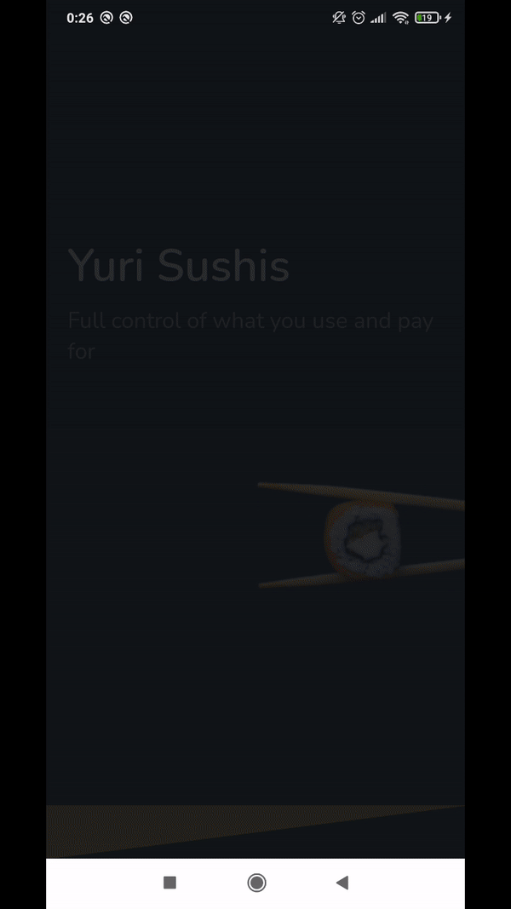

<h1 align="center">🍣 Yuri Sushis</h1>

<p align="center">
  

  

  <a href="https://github.com/paulocf92/yuri-sushis/commits/main">
    
  </a>

  
   <a href="https://github.com/paulocf92/yuri-sushis/stargazers">
    
  </a>
</p>

A yummy selection of sushi dishes and related products!

<p align="center"></p>

# 🚀 About the project

**Yuri Sushis** is a simple app that allows the user to browse a few sushi dishes and other related products, and book a reservation to try them out.

Main technologies used:

- ⭐ Expo (React Native)
- ⭐ Styled Components

Additional libs:

- Date FNS
- Lottie
- React Native Community's DateTimePicker

# ⚙️ Installing and Running

Install dependencies, set up `.env` and start Expo development.

```bash
# install dependencies
$ yarn install

# rename .env.example to .env and feed your Spoonacular api token

# run expo
$ expo start
```

## 📝 License

This project is under MIT license.

Made with ❤️ by [Paulo Filho](https://www.linkedin.com/in/paulocf92/)! 😊
